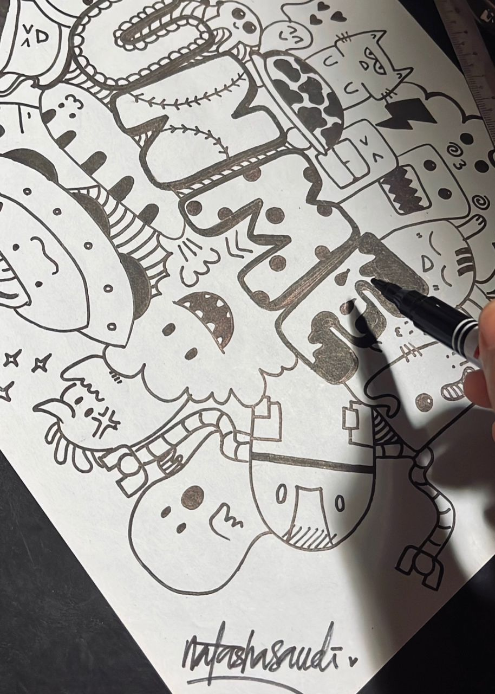
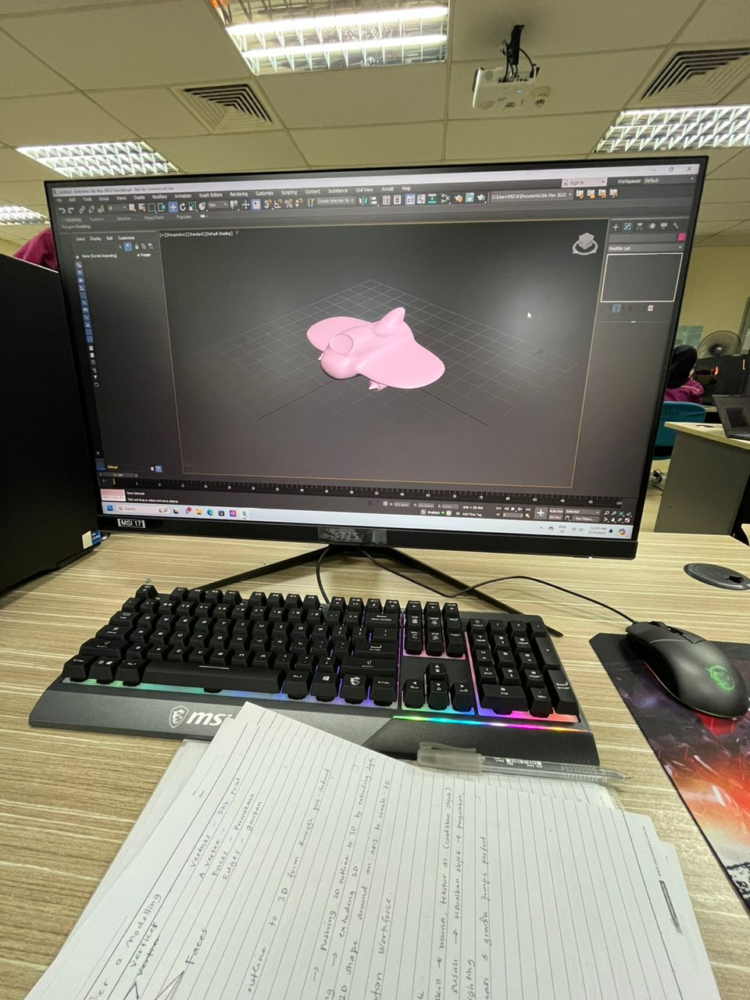
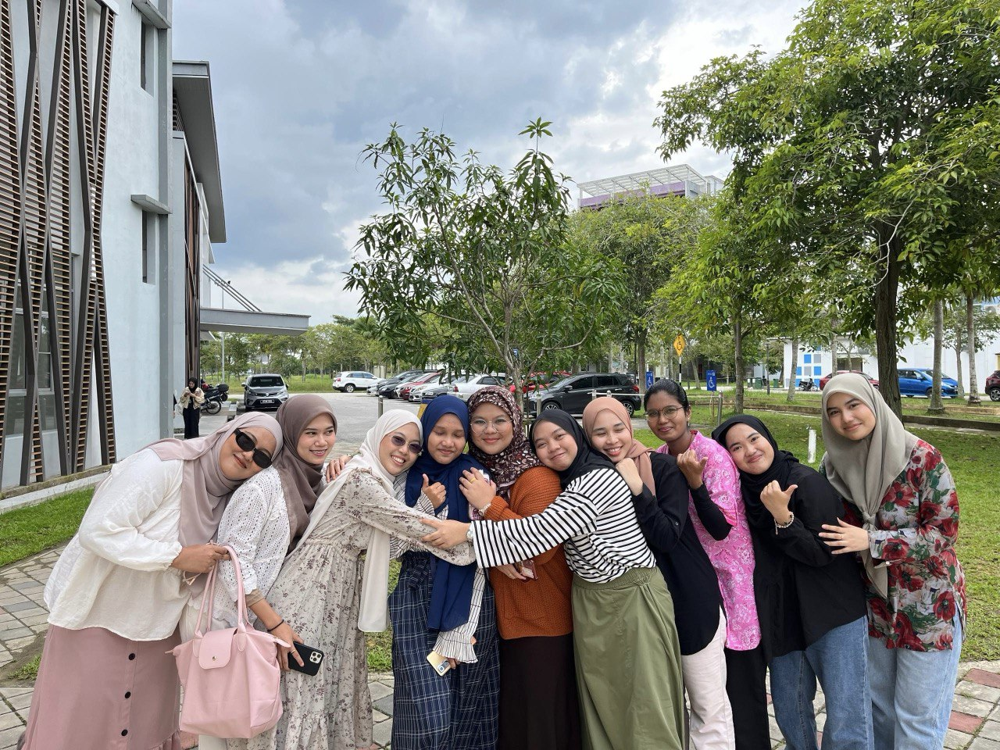

<!DOCTYPE html>
<html lang="en">
<head>
    <meta charset="UTF-8">
    <meta name="viewport" content="width=device-width, initial-scale=1.0">
    <title>Sha's Biography</title>
    
</head>
<body>
    <header>
        <h1>B I O G R A P H Y</h1>
        <nav>
            <ul>
                <li><a href="#" onclick="showSection('about')">About Me</a></li>
                <li><a href="#" onclick="showSection('activity')">Activities</a></li>
                <li><a href="#" onclick="showSection('people')">People</a></li>
                <li><a href="#" onclick="showSection('contact')">Contact</a></li>
            </ul>
        </nav>
    </header>

<section id="about">
   

       

           <h2>Me</h2>
           
Welcome to my world!
 
My name is Nurul Umi Natasha Binti Md.Saudi. I'm 23 years old. I'm Ubianese from Kota Belud, Sabah. I pursued a degree in Vocational Education (Creative Multimedia) with honors at Universiti Tun Hussein Onn Malaysia. I am the fifth child of six siblings. I am a third-year student and i'll be leaving from uni soon. Wish me luck to become a teacher in thefuture!

            <!-- Add Instagram, Facebook, and TikTok buttons -->
            

              <a href="https://www.instagram.com/natashasaudi?igsh=anFiNnN4bnVhODBy&utm_source=qr" target="_blank"><button>Instagram</button></a>

              <a href="https://www.facebook.com/natashasaudi/" target="_blank"><button>Facebook</button></a>

              <a href="https://www.tiktok.com/@ntshsdi?_t=8o818lkGF3B&_r=1"_blank"><button>TikTok</button></a>
        

           

             

             
           

        

   

    </section>

<section id="activity">
    <h2>Activities</h2>
    
These are my usual activities when i'm free.

 
     

 I love to singing. I have a few songs i have covered and posted it on my social media. 

<!-- Embedding the audio player for the MP3 file -->

 So, this is one of my cover song i covered during MCO. I was bored that time, so i try to sang this song and i did it! So enjoy! <3 

    <audio controls>
        <source src="Heather_Sri.mp3" type="audio/mp3">
        Your browser does not support the audio element.
    </audio>
  

<!-- Embedding the audio player for the MP3 file -->
<audio controls>
        <source src="Anji.mp3" type="audio/mp3">
        Your browser does not support the audio element.
    </audio>
  

 

    

 I also love to draw some picture randomly but it depends on my mood. I draw the doodle last year and all four picture i draw 2 years ago.

 

 

    

 Editing is my favourite activity too. I'll edit my photos or videos when i have a free time. In the picture above, i attended my 3D class, we have to make a 3D plane using a 3Ds Max Software. This is very exciting and i love it!

 

 

    

 One good thing about music is when it hits you, you feel no pain. The music also reminds us of the past. This is a reason why i love to listening to music. It had it's own story.

 

    
Acting is my favourite activity. Why? Because ii teach me to understand other people feeling. Such as, if I take on the role of a victim, I can feel and understand the soul of a victim. Here, I can identify and empathize the others feelings.   
So, here is my short video i've made 2 semester ago. Do watch it! 
 

    <title>Embedded YouTube Video</title>
	<iframe width="500" height="315"
	src="https://www.youtube.com/embed/02z3dNzoMDg">
</iframe>

	  
Don't forget to like, share and subscribe my youtube channel : 
     

</section>

    <section id="people">
        <h2>People</h2>
        
Family, friends and love are the foundation of a happy life. They are our backbone who are keep supporting us when we fall down.  

 
    

First family photo with complete members in 2019. After that, Abang Sopy has faced to His Creator. Al-Fatihah.
  

  
    

This is our family photo with incomplete members. We took this picture on Hari Raya last year.
  

  
    

My soulmate. InsyaAllah. Do pray the best for us. Hehe
  

  
    

My lovely friends. We have another year and half together before we seperate with our respective journeys. Hopefully, we can survive until the end. Aminnn. 

   

    </section>

    <section id="contact">
        <h2>Contact</h2>
        
Please contact me via the form below or through email.

        <form action="contact.php" method="POST">
            <label for="name">Name:</label>
            <input type="text" id="name" name="name"required> 
            <label for="email">Email:</label>
            <input type="email" id="email" name="email"required> 
            <label for="message">Message:</label> 
            <textarea id="message" name="message" rows="4" required></textarea> 
            <input type="submit" value="Send">
        </form>
    </section>

    <footer>
        
&copy; 2024 Sha's Biography.

    </footer>

    
</body>
</html>
